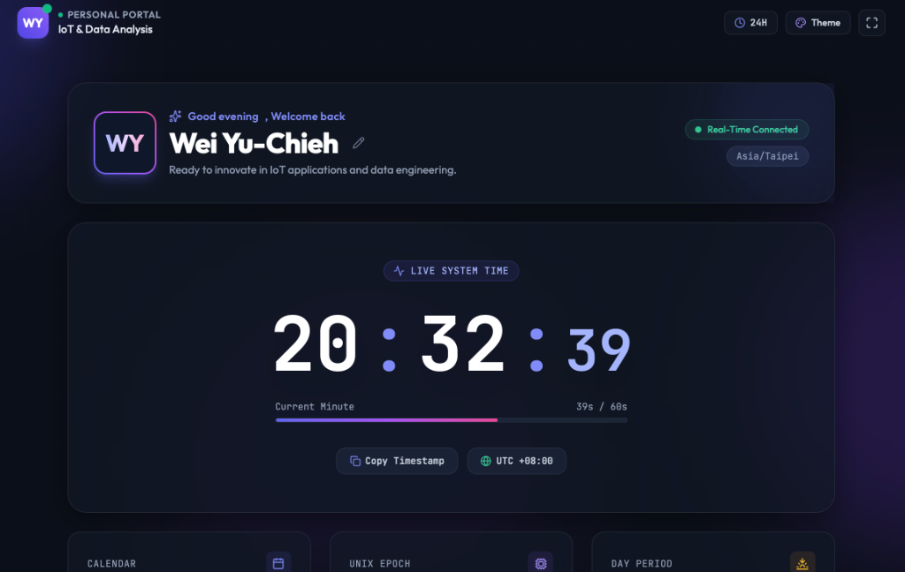

# 🌌 Personal Dashboard & Real-Time Clock

[](https://marukomaru777.github.io/260916-DIC/)
[](https://tailwindcss.com/)
[](https://developer.mozilla.org/en-US/docs/Web/JavaScript)
[](LICENSE)

An elegant, modern personal landing page and live precision clock dashboard designed with **Tailwind CSS v3**, **Lucide Icons**, and modern glassmorphism aesthetics.

🔗 **線上展示網址 (Live URL)**: [https://marukomaru777.github.io/260916-DIC/](https://marukomaru777.github.io/260916-DIC/)  
📦 **GitHub 專案原始碼 (Repository)**: [https://github.com/marukomaru777/260916-DIC](https://github.com/marukomaru777/260916-DIC)

---

<p align="center">
  
</p>

---

## ✨ 核心特色 (Key Features)

### 1. 👤 個人身分與動態問候 (Identity & Dynamic Greetings)
- **個人姓名展示**：預設顯示「Wei Yu-Chieh」，配備精緻漸層光暈頭像與首字縮寫（WY）。
- **即時編輯與保存**：點擊姓名右側的編輯鉛筆圖示即可修改顯示名稱，自動儲存於瀏覽器 `localStorage`。
- **動態時段問候**：根據當前小時自動切換（清晨專注、午後心流、傍晚沉澱、深夜專注）。
- **課程狀態標籤**：標記 `IoT & Data Analysis` 與連線狀態指示燈。

### 2. ⏰ 零跳動高精度數位時鐘 (Precision Real-Time Clock)
- **等寬數字排版**：採用 Google Fonts `JetBrains Mono` 字型，徹底解決數字變動時的文字抖動問題。
- **12H / 24H 雙格式切換**：可一鍵在標準 12 小時制（附 AM/PM 指示）與 24 小時軍用時間之間即時切換。
- **動態秒數進度條**：視覺化呈現當前分鐘（0s ~ 60s）的時間流逝百分比。
- **自動偵測時區與 UTC 偏差**：即時取得用戶端地理時區（如 `Asia/Taipei`）與偏差值（如 `UTC +08:00`）。

### 3. 📊 多功能系統小工具 (System & Calendar Widgets)
- **日曆卡片 (Calendar)**：顯示當日星期、完整年月日、ISO 國際週數（如 `W38`）。
- **Unix Epoch 時間戳記**：即時換算 1970 年以來的總秒數與當年度第幾天（Day of Year）。
- **時段模式與格言 (Solar Phase)**：對應日夜週期的專注座右銘。
- **一鍵複製時間戳記**：提供 Copy 按鈕，一鍵複製標準 ISO 時間戳記並彈出 Toast 提示。

### 4. 🎨 極致現代 UI/UX 設計 (Rich Aesthetics)
- **暗黑極光毛玻璃 (Dark Aurora Glassmorphism)**：動態流暢的漸層光球背景（Ambient Glow Orbs）與 `backdrop-blur` 毛玻璃卡片。
- **4 種主題切換 (Theme Switcher)**：支援 Aurora Violet、Cyber Cyan、Emerald Neon 與 Solar Amber 極光配色切換。
- **全螢幕模式 (Fullscreen)**：支援一鍵切換全螢幕沈浸式時鐘模式。
- **完全響應式佈局 (Responsive)**：完美適配手機、平板與桌上型電腦螢幕。

---

## 🛠️ 技術架構 (Tech Stack)

| 領域 | 技術 / 工具 | 說明 |
| :--- | :--- | :--- |
| **Structure** | HTML5 Semantic Elements | 語意化標籤，結構完整且具備良好 SEO |
| **Styling** | Tailwind CSS v3 | 現代化實用類別優先樣式庫 + PostCSS + Autoprefixer |
| **Typography**| Outfit & JetBrains Mono | Google Fonts 現代無襯線與等寬字型 |
| **Icons** | Lucide Icons | 現代輕量向量圖示庫 |
| **Scripting** | Vanilla JavaScript (ES6+) | 輕量即時渲染引擎、狀態管理與本機持久化 |
| **Hosting** | GitHub Pages | 全球 CDN 自動部署與免費 HTTPS 安全連線 |

---

## 📁 目錄結構 (Project Structure)

```text
├── assets/
│   └── preview.png      # 儀表板預覽截圖
├── index.html           # 主要網頁入口結構（語意化 HTML5 與組件標記）
├── script.js            # 即時時鐘運算、格式切換、問候語與互動邏輯
├── src/
│   └── input.css        # Tailwind CSS 指令與毛玻璃自訂特效
├── dist/
│   └── output.css       # 編譯與壓縮後的最佳化 CSS 檔案 (約 21KB)
├── tailwind.config.js   # Tailwind 主題、客製動畫、字型與色彩設定
├── postcss.config.js    # PostCSS 設定檔
├── package.json         # 專案依賴庫與建置腳本
└── .gitignore           # 排除 node_modules 與暫存檔
```

---

## 🚀 本地開發與運行 (Getting Started)

### 1. 下載專案
```bash
git clone https://github.com/marukomaru777/260916-DIC.git
cd 260916-DIC
```

### 2. 安裝相依套件
```bash
npm install
```

### 3. 編譯 Tailwind CSS
```bash
# 單次建置並壓縮
npm run build:css

# 監聽模式（修改 CSS/HTML 時自動編譯）
npm run dev:css
```

### 4. 啟動本地伺服器
```bash
npm run serve
```
開啟瀏覽器訪問 [http://localhost:3000](http://localhost:3000) 即可瀏覽。

---

## 🌐 部署說明 (Deployment)

本專案已設定透過 **GitHub Pages** 自動部署：
- **分支**：`main`
- **路徑**：`/` (根目錄)
- **線上網址**：[https://marukomaru777.github.io/260916-DIC/](https://marukomaru777.github.io/260916-DIC/)

未來若有任何程式碼更新，只需推送到 `main` 分支，GitHub Pages 便會自動重新建置並部署最新版本！
